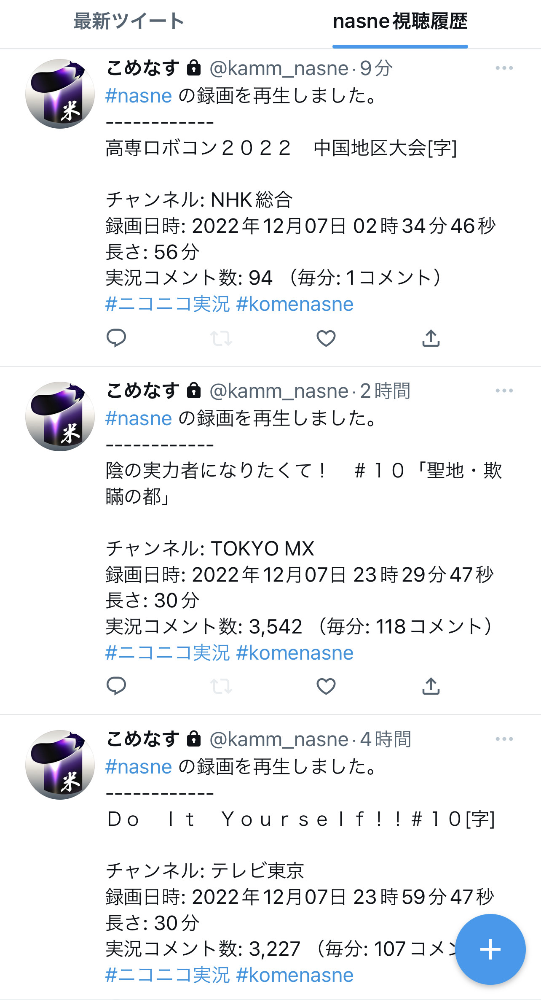

# komenasne について
  
<span style="font-size: 80%; float: right;">＊画像は「PC TV Plus」と「commenomi」を組み合わせて再生させたイメージです</span>  
  
### [ダウンロードはこちら](https://github.com/nyumen/komenasne/releases)
  
  
## 概要
nasneの動画再生と合わせての実況コメントを再生します。  
*使用イメージは以下のnoteの記事を参照  
[komenasneでトルネっぽく実況コメント付きでnasneの動画を再生させる](https://note.com/kamm/n/n8a519502718c)*  
  
  
## アップデート内容
- jkcommentviewrの連動に対応しました。
- 録画を再生した際にツイートすることが可能なりました（実況コメント数を確認したかったためと、ライフログ的な目的で作者が欲しかった機能）
- 上記のツイート機能と関連して、常駐して起動することが可能になりました（出先でスマホのtorneで再生したときもツイートさせたかったため）  
  

  
## 説明
- nasneの再生に連動して、commenomi（こめのみ）を実行アプリです。v1.1より視聴中のチャンネルに応じたjkcommentviewerの起動にも対応。
- Windowsのnasne動画再生ソフト「PC TV Plus」が必要です。
- 動作設定はiniファイル。事前に自分の環境に合わせてテキストエディタで書き換える必要あり（nasneのローカルIPやチャンネル設定など）
- 過去ログAPIの取得タイミングのため、直近15分以内のコメントは取得できません。
- 常駐モードで起動することにより、torneやPC TV Plusで録画を再生したタイミングで番組情報をツイートする機能も搭載(v1.1より)
- PC TV Plusやtorneにニコニコ実況機能が搭載されたので存在意義が微妙になりましたが、BS民放のコメントも再生することができます。  
  
## セットアップ
komenasne.iniを開き、[NASNE]セクションの"ip"にカンマ区切りでIPを記入してください。nasneのIPはtorneの設定画面で確認できます。  
*バージョンの古いメモ帳を使っている場合は、改行されずに表示されます。Windows10を最新版にアップデートするか、テキストエディタで編集してください。*    
次に、commenomi_pathを自分の環境に修正してください。commenomi.exeのプロパティからパスをコピーできます。  
jkcommentviewerと連動したい場合はjkcommentviewer_pathを修正してください。  
Twitterと連動したい場合は[TWITTER]も設定してください。[こちら](https://note.com/kamm/n/n8a519502718c)に説明があります。メインアカウントは邪魔になるので専用アカウントを作るのがおすすめです。　 
  
  
## 実行
- komenasne.exeをタスクバーの一番左に配置し、視聴したい録画を再生したあとにWindowsキーを押しながら数字の1を押すと、commenomiやjkcommentviewerが起動します。commenomiは右クリックして「このウィンドウを常に最前面に」のチェックをつけてください。
インストーラーの仕様上、ウィルス対策ソフトWindows Defenderの誤検知に引っかかりやすいため、都度許可するかディレクトリごと対象外としてください。  
参考：[Windows 10のWindows Defenderで特定のファイルやフォルダーをスキャンしないように設定する方法](https://faq.nec-lavie.jp/qasearch/1007/app/servlet/relatedqa?QID=018507)
  
  
## コメント流量設定
v1.08から実装されたコメント流量調整機能の説明です。
komenasne.iniに[COMMENT]という項目が追加されています。コメント流量が指定した値を超えると、オリジナルのxmlファイルとともに間引きされたlimitファイルが作成されます。
例：
```
TBSテレビ_20211121_205946_54_日曜劇場「日本沈没－希望のひと－」第６話「抗えない日本沈没」[字][デ].xml
↓↓↓
TBSテレビ_20211121_205946_54_日曜劇場「日本沈没－希望のひと－」第６話「抗えない日本沈没」[字][デ]_limit.xml
```
設定値について
"comment_limit": noneを指定すると流量調整機能は動作しません。middleにするとおおよそコメントが重ならない程度のコメント量となり、lowの場合は字幕が読める程度にまで減ります。
"aborn_or_delete": 間引きされたコメントの行を削除するか非表示コメントに置き換えるかが選択できます。勢いグラフを使用しない方は、commenomiの動作が軽くなるdeleteを指定してください。
"limit_ratio" 間引きされたコメントが少ない場合、limitファイルを作成しない条件を指定します。例として、5を指定した場合、本来のコメント数に対して間引きされたコメント数が5%未満であればlimitファイルを作成しません。
＝＝＝
ちなみに歌詞ニキさんの下部固定コメントについては必ず表示されるようになっています。

komenasne.iniのデフォルト設定値(推奨値)
```[COMMENT]
# コメント流量設定 none, low, middle, high
comment_limit = middle
# 間引きしたコメントの出力設定
# aborn: 透明あぼーん(勢いグラフはそのまま、ファイルサイズ大), delete: 削除(勢いグラフ不正確、ファイルサイズ小)
aborn_or_delete = aborn
# 間引きしたコメント数がこの数値の%以下の場合、limitファイルを作成しない(0-99で指定、0で必ずlimitファイルを作成)
limit_ratio = 5
```
  
## commenomiの便利なショートカット
- SPACE 一時停止/再生
- A 最初のAのコメントに移動
- B 最初のBのコメントに移動
- C 最初のCのコメントに移動
- 0 先頭に戻る
- Ctrl + F コメント検索
- → 早送り
- ← 早戻し
- Ctrl + → 高速早送り
- Ctrl + ← 高速早戻し
- マウスのホイールで微調整
  
  
## 高度な使い方
【常駐モード】  
mode_monitoringをつけると、常時起動して1分に1回NANSEをチェックし、過去ログのダウンロードとツイートのみ行います。commenomiは起動しません。
```
komenasne.exe mode_monitoring
```
  
  
【直接取得モード】  
再生中のNASNEの情報を参照せず、チャンネルと日時を指定してコメントログを取得する機能です。
```
komenasne.exe [channel] [yyyy-mm-dd HH:MM] [total_minutes] option:[title]
例1: komenasne.exe "jk181" "2021-01-25 02:00" 30 "＜アニメギルド＞ゲキドル　＃３"
例2: komenasne.exe "TBS" "2021-01-23 21:00" 60
チャンネルリスト: NHK Eテレ 日テレ テレ朝 TBS テレ東 フジ MX BS11 または以下のjk**を指定
jk1 NHK総合
jk2 NHK Eテレ
jk4 日本テレビ
jk5 テレビ朝日
jk6 TBSテレビ
jk7 テレビ東京
jk8 フジテレビ
jk9 TOKYO MX
jk101 NHK BS1
jk103 NHK BSプレミアム
jk141 BS日テレ
jk151 BS朝日
jk161 BS-TBS
jk171 BSテレ東
jk181 BSフジ
jk191 WOWOWプライム
jk211 BS11
jk222 BS12
jk236 BSアニマックス
jk333 AT-X
```
  
  
【サイレントモード】  
mode_silentをつけるとkommenomiが起動せず、xmlファイルのみが作成されます。
```
komenasne.exe mode_silent
```
  
  
## スペシャルサンクス
- commenomi (こめのみ) http://air.fem.jp/commenomi/
- ニコニコ実況 過去ログ API https://jikkyo.tsukumijima.net/
- チャンネルリスト　NicoJK　elaina/saya
- アイコン提供 SW-326JKM様 https://www.nicovideo.jp/user/289866
 
  
