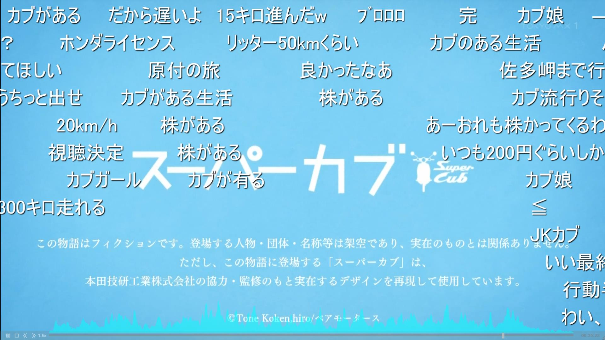
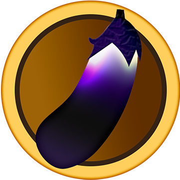

# komenasne について


### [ダウンロードはこちら](https://github.com/nyumen/komenasne/releases)

## 概要
nasneの動画再生と連動して、ニコニコ実況の過去ログコメントを再生するツールです。
コメントの表示には [komeview](https://github.com/nyumen/komeview) を使用します。

*使用イメージは以下のnoteの記事を参照（旧バージョンの記事です）
[komenasneでトルネっぽく実況コメント付きでnasneの動画を再生させる](https://note.com/kamm/n/n8a519502718c)*

## 動作に必要な環境
- nasne
- Windows環境
- PC TV Plus
- [komeview](https://github.com/nyumen/komeview/releases)
- jkcommentviewer（任意）

## 説明
- nasneの再生に連動して、komeview を起動しコメントを再生します。ライブ視聴中はチャンネルに応じた jkcommentviewer の起動に対応。
- Windowsのnasne動画再生ソフト「PC TV Plus」が必要です。
- **nasneのIPは自動発見されます**（初回起動時に探索してキャッシュ）。IPが変わったときは `komenasne.exe --discover` で再探索できます。
- 過去ログAPIの取得タイミングのため、直近5分以内のコメントは取得できません。
- 視聴記録の **Bluesky への自動投稿**（任意）に対応しています。

## セットアップ
1. [Releases](https://github.com/nyumen/komenasne/releases) から `komenasne-win.zip` をダウンロードして展開します。
2. [komeview](https://github.com/nyumen/komeview/releases) をインストールします。
3. フォルダ内の `komenasne.ini.example` を `komenasne.ini` にリネームし、テキストエディタで開いて
   `[PLAYER]` の `komeview_path` を自分の環境の komeview.exe のパスに書き換えます。
4. jkcommentviewer と連動したい場合は `jkcommentviewer_path` も設定します（省略可）。
5. Bluesky に視聴記録を投稿したい場合は `[BLUESKY]` の `handle` と `app_password` を設定します
   （アプリパスワードは Bluesky の 設定 → アプリパスワード で発行 / 省略可）。
6. `komenasne.exe` を右クリックして「タスクバーに配置」を選び、タスクバーの一番左に配置します。

※ nasneのIPは通常設定不要です。自動発見が効かないネットワーク構成の場合のみ `[NASNE]` の `ip` に手動で設定してください。

## 実行
- （komenasneがタスクバーの一番左に配置されている状態で）PC TV Plusで番組の再生が開始された後に
  Windowsキーを押しながら数字の1を押すと、komeview が起動し再生中の番組のコメントが流れます。
- コメントは自動で再生開始されます。アニメの場合、本編が始まった瞬間にキーボードの `k` を押すと大体時間が合わせられます。
  それ以外はカーソルキーやマウスホイールでタイミングを合わせてください。
- Windows Defender の誤検知に引っかかる場合は、都度許可するかフォルダごとスキャン対象外にしてください。
  参考：[Windows 10のWindows Defenderで特定のファイルやフォルダーをスキャンしないように設定する方法](https://faq.nec-lavie.jp/qasearch/1007/app/servlet/relatedqa?QID=018507)

## komeviewの便利なショートカット
- `Space` 一時停止/再生
- `k` ｷﾀ━━━(ﾟ∀ﾟ)━━━!! のコメント位置へジャンプ（番組開始の頭出しに便利）
- `o / a / b / c / e` OP / Aパート / Bパート / Cパート / ED へジャンプ
- `j` 次のマーカーへジャンプ
- `← →` 1秒シーク
- `↑ ↓` 大きくシーク（デフォルト15秒）
- マウスホイールで微調整
- ダブルクリックで全画面とウインドウ表示の切り替え
- 右クリックでメニュー（コメントリスト・フォントサイズ・NG設定など）

## コマンドラインオプション
```
nasneの再探索（IPが変わった時に実行）: komenasne.exe --discover
録画失敗リストの表示: komenasne.exe --recerror [絞り込みキーワード]
サイレントモード（XML作成のみ）: komenasne.exe --mode_silent
常駐モード: komenasne.exe --mode_monitoring
再生中の番組時間を強制上書き: komenasne.exe --fixlive 30
ファイル名から時間変更で再取得: komenasne.exe --fixrec 30 "TOKYO MX_20230210_001202_30_お兄ちゃんはおしまい！ ＃６.xml"
```

【直接取得モード】
再生中のnasneの情報を参照せず、チャンネルと日時を指定してコメントログを取得する機能です。
```
komenasne.exe [channel] [yyyy-mm-dd HH:MM] [total_minutes] option:[title]
例1: komenasne.exe "jk181" "2021-01-25 02:00" 30 "＜アニメギルド＞ゲキドル　＃３"
例2: komenasne.exe "TBS" "2021-01-23 21:00" 60
チャンネルリスト: NHK Eテレ 日テレ テレ朝 TBS テレ東 フジ MX BS11 または jk1 等の実況ID
```

## 開発
```sh
# 依存のインストール（Python 3.12+）
python -m venv .venv
.venv\Scripts\activate
pip install .

# 設定ファイルを用意（src/komenasne.ini はリポジトリに含まれません）
copy komenasne.ini.example src\komenasne.ini
# → src\komenasne.ini を自分の環境に合わせて編集

# 実行
python src\komenasne.py --discover

# ローカルビルド（dist\komenasne\ に出力）
src\build.bat
```
リリースは GitHub Actions で自動ビルドされます（`v*` タグの push で `komenasne-win.zip` を Release に添付）。

## スペシャルサンクス
- komeview https://github.com/nyumen/komeview
- commenomi (こめのみ) http://air.fem.jp/commenomi/ ＊旧バージョンで使用
- ニコニコ実況 過去ログ API https://jikkyo.tsukumijima.net/
- NX-Jikkyo https://nx-jikkyo.tsukumijima.net
- チャンネルリスト　NicoJK　elaina/saya
- アイコン提供 SW-326JKM様 https://www.nicovideo.jp/user/289866


